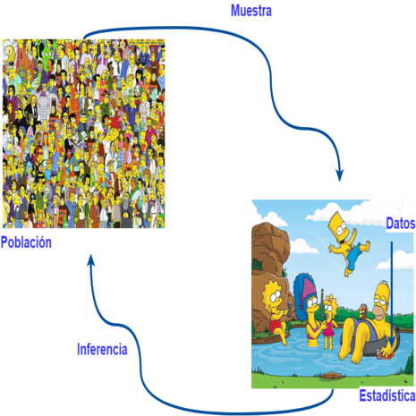
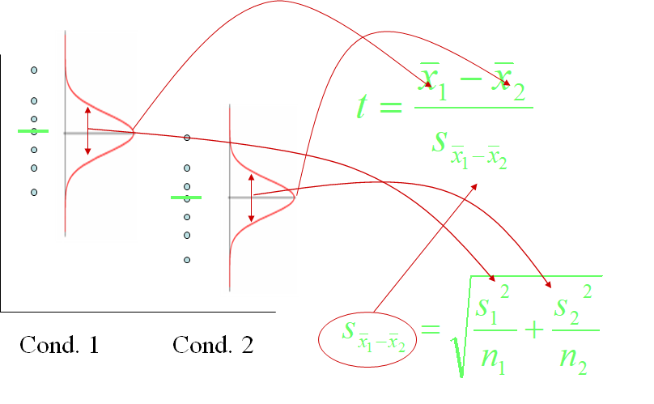

## Una mirada NO estadística...

```{r, echo=FALSE,fig.align='center'}
      
```


En un juicio el jurado debe decidir entre dos hipótesis. La _hipótesis nula_ es: 


$$H_0: \text{El acusado es  inocente}$$

_La hipótesis alternativa o del investigador es:_ 

$$H_a: \text{El acusado es culpable}$$

> El jurado _no sabe_ cual de las dos hipótesis es cierta. El debe tomar la decisión con base a la _evidencia_ presentada. 

--- .class #id 

## Una mirada NO estadística...

<span style="display:block; height: 2cm;"></span>

```{r, echo=FALSE,fig.align='center'}
      knitr::include_graphics('./figure/Inferencia.png')
```

--- .class #id 

## Una mirada NO estadística...

A partir del veredicto del jurado se pueden presentar dos _tipos de errores_: 

> 1. El jurado condena a una persona inocente.
    + Es denominado _Error Tipo I_ y ocurre cuando rechazamos una hipótesis nula      verdadera. 
 

> 2. El jurado declara inocente a una persona culpable.
    + Es denominado _Error Tipo II_ y ocurre cuando no rechazamos una hipótesis nula      falsa.  

```{r, echo=FALSE,fig.align='center',}
      knitr::include_graphics('./figure/error.jpg')
```

---

## Una mirada NO estadística: Conceptos claves

Bajo este panorama los conceptos críticos a tener en cuenta son:
>1. Hay dos hipótesis, $H_0$ y $H_a$.
>2. El desarollo de la inferencia asume de partida que la hipótesis nula ($H_0$) es verdadera. 
>3. El objetivo es determinar _si hay suficiente evidencia_ para inferir que la hipótesis alternativa es cierta o  que la nula es poca probable para ser verdadera. 
>4. Hay dos posibles decisiones: 
 + Rechazar la hipótesis nula
 + No hay suficiente evidencia para soportar $H_a$

---

## Conceptos en Pruebas de hipótesis

```{r, echo=FALSE,fig.align='center',}
      
```

---

## Comparando dos grupos... 

```{r, echo=FALSE, fig.align='center', message=FALSE, warning=FALSE}
require(ggpubr)
wdata = data.frame(
   Cepa = factor(rep(c("Pseudomonas sp.", "Serratia sp."), each=200)),
   Deg = c(rnorm(200, 52), rnorm(200, 58)))
ggboxplot(wdata, x='Cepa',y='Deg', xlab='Cepa bacteriana',ylab='Concentración (ppm)')
```

--- 

## Comparando dos grupos...

<span style="display:block; height: 2cm;"></span>
$$ H_0: Promedio_{Pseudomonas} =  Promedio_{Serratia}$$
```{r, echo=FALSE,fig.align='center',}
      
```

---


## Comparando dos grupos...

<span style="display:block; height: 2cm;"></span>
$$ H_a: Promedio_{Pseudomonas} \neq  Promedio_{Serratia}$$

```{r, echo=FALSE,fig.align='center',}
      knitr::include_graphics('./figure/banana.gif')
```

---

## Comparando dos grupos...

<span style="display:block; height: 5cm;"></span>


$$ t = \frac{ \bar{X_1} - \bar{X_2} }{S_{ \bar{X_1} -  \bar{X_2} }  } $$


---

## Comparando dos grupos...
<span style="display:block; height: 2cm;"></span>
```{r, echo=FALSE,fig.align='center',}
      
```

---

## Reglas de decisión
<span style="display:block; height: 3cm;"></span>

>1. Intervalos de confianza
<span style="display:block; height: 2cm;"></span>
>2. Valores P 

---

## Interpretando el Valor P 

<span style="display:block; height: 2cm;"></span>

```{r, echo=FALSE,fig.align='center',}
      knitr::include_graphics('./figure/pvalue.png')
```

--- 

## Salida Prueba _t_
```{r}
wdata = data.frame(
   Cepa = factor(rep(c("Pseudomonas sp.", "Serratia sp."), each=200)),
   Deg = c(rnorm(200, 52), rnorm(200, 58)))
t.test(Deg~Cepa, var.equal = T,data=wdata)


```

